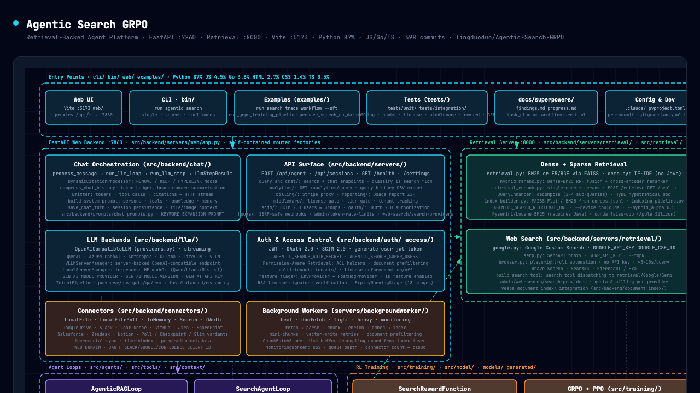

# Agentic Search

Agentic Search is a retrieval-backed platform for building multi-turn search, RAG, and tool-using agents. It combines a FastAPI backend, interchangeable retrieval services, a React development UI, and training and evaluation workflows in one repository.

## What it provides

- Agentic RAG with multi-turn search, query enhancement, citations, and grounded synthesis
- Conversation and tool-using agents with routing, memory, and structured tool dispatch
- Dense, sparse, and hybrid retrieval with fusion, reranking, and optimization workflows
- Connectors, document ingestion, indexing, and background processing
- Web search through Google Custom Search, SerpAPI, and browser automation
- A React chat UI with streaming responses, source inspection, and observability surfaces
- Supervised, GRPO/PPO, and evaluation workflows for search agents
- An MCP server that exposes search and retrieval to compatible clients

## Architecture

[](agentic-search-grpo-architecture.html)

*Click the image to open the interactive version. See [Architecture](docs/architecture.md) for the repository layout and request flows.*

## Prerequisites

- Python 3.10+
- Node.js and npm
- An LLM provider API key for agent loops
- Java only when using BM25/pyserini

## Install

From the repository root:

```bash
pip install -e .
pip install -r requirements.txt
```

Install the optional MCP dependencies when needed:

```bash
pip install -e ".[mcp]"
```

Install frontend dependencies:

```bash
cd web && npm install
```

## Configure

Copy the example environment file, then provide the model settings required by your LLM provider:

```bash
cp .env.example .env
```

```dotenv
GEN_AI_MODEL_PROVIDER=openai
GEN_AI_MODEL_VERSION=gpt-4o-mini
GEN_AI_API_KEY=...
```

Provider, web-search, retrieval, reranking, routing, and application settings are documented in [Configuration](docs/configuration.md).

## Request routing

With `mode` omitted, `/api/agent` classifies each request as `chat`, `search`, or `tool`. An unfiltered auto-routed search tries internal retrieval first; weak or empty evidence falls through to SerpAPI and then the configured browser-search service. If no source returns evidence, the API reports that directly instead of asking a local model to answer from memory. See [API request routing](docs/request-routing.md) for modes, provider precedence, access-filter behavior, metadata, and examples.

Searchable documents are prepared before query time by the existing asynchronous ingestion and indexing jobs. At query time, the existing `/api/agent` and `/api/agent/stream` endpoints load bounded session history, build a follow-up-aware retrieval query, retrieve candidates, apply one centralized ranking/reranking policy, and synthesize only when evidence exists. The finalized answer, citations, documents, and stage metadata are persisted through the same response path for JSON and SSE. This internal simplification introduces no new public API and does not change the request or response schemas.

## Run locally

Start each service in a separate terminal from the repository root.

### 1. Start retrieval

The bundled demo corpus is served on port **8001**:

```bash
python3 -m src.internal.servers.retrieval.demo --corpus_path data/corpus.jsonl
```

### 2. Start the API

The FastAPI backend runs on port **7860**:

```bash
PYTHONPATH=src:. uvicorn src.internal.servers.web.app:app --host 127.0.0.1 --port 7860
```

### 3. Start the frontend

The live Vite development UI runs on port **5173** and proxies backend requests to port 7860:

```bash
cd web && npm run dev
```

Open <http://127.0.0.1:5173>.

## Verify the stack

Check retrieval against the bundled corpus:

```bash
curl -s -X POST http://127.0.0.1:8001/retrieve \
  -H 'Content-Type: application/json' \
  -d '{"query": "what is FAISS?", "topk": 5}' | python3 -m json.tool
```

Check the API health endpoint:

```bash
curl -s http://127.0.0.1:7860/health | python3 -m json.tool
```

## Common development commands

```bash
pytest                              # backend unit and regression tests
cd web && npm run typecheck         # frontend TypeScript check
cd web && npm run test              # frontend typecheck and unit tests
cd web && npm run build             # production bundle served by FastAPI
```

See [Testing](docs/testing.md) for focused suites and integration-test prerequisites.

## Troubleshooting

- **Frontend changes look stale:** open <http://127.0.0.1:5173> for live Vite updates. Port 7860 serves the last production bundle built into `web/dist`.
- **BM25/pyserini cannot find Java:** install Java and set `JAVA_HOME` to the active JDK. The demo TF-IDF retrieval server does not require Java.
- **An explicit local policy-agent mode returns an empty answer or zero sources:** small models often fail to emit the required `<search>` and `<answer>` tags. Use a more capable policy model or choose `chat_loop`/`hybrid_search`. The default auto-routed search path is evidence-first and does not depend on a local policy model; see [API request routing](docs/request-routing.md) and [Configuration](docs/configuration.md).
- **Dense retrieval is slow or fails on your hardware:** CPU is the default; dense embedding and reranking services can use CUDA on a supported NVIDIA host or MPS on Apple Silicon. For in-process Hugging Face policy-model inference, CPU is the safest default because some model, PyTorch, and Transformers combinations can segfault on MPS. Only opt in with `--allow_unsafe_mps` after accepting that risk; see [Training and evaluation](docs/training-and-evaluation.md) for device-specific commands.
- **Dataset preparation reports a `pyarrow` extension error:** rerun `pip install -r requirements.txt` to restore the compatible dependency set.
- **Requests fail or agent loops cannot answer:** confirm retrieval on port 8001, the API on port 7860, and Vite on port 5173 are running. Agent loops also need a valid provider key; web-search modes need the corresponding search-provider keys.

## Documentation

- [Architecture](docs/architecture.md) — repository layout, agent families, routing, and request flows
- [API request routing](docs/request-routing.md) — modes, intent classification, provider order, fallbacks, and response metadata
- [Retrieval](docs/retrieval.md) — retrieval services, indexing, reranking, tuning, and query transformation
- [HTTP API reference](docs/api-reference.md) — local retrieval, web, chat/session, and health endpoints
- [Training and evaluation](docs/training-and-evaluation.md) — examples, datasets, SFT, GRPO/PPO, and benchmarks
- [Frontend development](docs/frontend.md) — React/Vite workflow, UI behavior, and observability surfaces
- [MCP server](docs/mcp.md) — installation, transport, client configuration, tools, and resources
- [Configuration](docs/configuration.md) — environment variables for providers, services, retrieval, and routing
- [Testing](docs/testing.md) — backend and frontend checks, integration tests, and debugging commands
